# Function echartR with package recharts
Author: `r Sys.info()[['user']]`  
Edited: `r format(Sys.time(),'%x %X')`  

本工具来源于百度开发的国内顶尖水平的开源`d3-js`可视项目[Echarts](http://echarts.baidu.com/)([Github Repo](https://github.com/ecomfe/echarts))。Yang Zhou和Taiyun Wei基于该工具开发了[recharts](https://github.com/taiyun/recharts)包，经Yihui Xie[修改](https://github.com/yihui/recharts)后，可通过`htmlwidgets`传递js参数，大大简化了开发难度。但此包开发仍未完成。为了赶紧上手用，基于该包做了一个函数`echartR`，用于制作基础Echart交互图。需要R版本>=3.2.0.

This tool originates from a top-tier `d3-js` visualization project of China: [Baidu Echarts](http://echarts.baidu.com/)([Github Repo](https://github.com/ecomfe/echarts)). Yang Zhou and Taiyun Wei developed an experimental R package [recharts](https://github.com/taiyun/recharts) based on it, which then evoluted into [yihui/recharts](https://github.com/yihui/recharts) by Yihui Xie to pass js parameters through `htmlwidgets`. The package is sill uder development. I developed a function `echartR` based on this package to make basic Echarts interation charts. This function requires R>=3.2.0.

`echartR`的主要工作是将Echarts参数封装成list，Yihui Xie的原型函数`echart`被用来处理这个list。`echart`函数的[基本用法](http://yihui.name/recharts)如下，除了数据本身，并没有提供其他参数的设置方法。

`echartR` majorly packs Echarts parameters into a list while `echart`, the prototype function developed by Yihui Xie, is used to parse the list. The [basic examples](http://yihui.name/recharts) of `echart` is as follows, which does not provide parameters entries other than dataset itself.
```r
if (! 'recharts' %in% installed.packages()[,1]){
    install.packages('recharts',
                     repos = c('http://yihui.name/xran', 'http://cran.rstudio.com')
                     )
}
library(recharts)
echart(iris, ~Sepal.Length, ~Sepal.Width)
```


```r
echart(iris, ~Sepal.Length, ~Sepal.Width, series = ~Species)
```


echartR则主要细化了部分参数的设置方法，可以做出如下效果的动图：


# Usage 用法
- 首先，安装好最新版的[R](http://www.r-project.org)和[Rstudio](http://www.rstudio.com)
- 了解最基本的R语言技巧，能够用R整理、读写数据集
- 最好会用`knitr`，会写[`rmarkdown`](http://rmarkdown.rstudio.com/)

## Installation 安装
- 安装 Install `devtools` (`install.packages('devtools')`)
- 安装 Insall recharts (`install_github('yihui/recharts')`)
- 下载 Download `echartR.R`脚本文件到本地位置 script file to local disk:  [https://github.com/madlogos/recharts/blob/master/R/echartR.R](https://github.com/madlogos/recharts/blob/master/R/echartR.R))
- 调用 Source `echartR` 脚本 script (假设我将脚本放在本地 suppose I stored the script to local GitHub Repo: `source("~/Github/recharts/R/echartR.R")`)

## Grammar 语法

```
echartR(data, x=NULL, y, z=NULL, series=NULL, weight=NULL, 
        xcoord=NULL, ycoord=NULL, x1=NULL, xcoord1=NULL, ycoord1=NULL, 
        type="scatter", stack=FALSE,
        title=NULL, subtitle=NULL, title_url=NULL, subtitle_url=NULL,
        symbolList=NULL, dataZoom=NULL, 
        dataRange=NULL, splitNumber=NULL, dataRangePalette=NULL,
        xAxis=list(lab=NULL,color=NULL,splitLine=T,banded=F), xlab=NULL,
        yAxis=list(lab=NULL,color=NULL,splitLine=T,banded=F), ylab=NULL,
        xyflip=FALSE, AxisAtZero=TRUE, scale=TRUE,
        palette='aetnagreen', tooltip=TRUE, legend=TRUE, toolbox=TRUE, 
        pos=list(title=6, legend=11, toolbox=1, dataZoom=6, dataRange=8, roam=2),
        calculable=TRUE, asImage=FALSE,
        markLine=NULL, markLinesmooth=NULL, markPoint=NULL, 
        theme=list(backgroundColor=NULL, borderColor=NULL),
        ...))
```

- **data**: 数据集 dataset
- x: x变量，直方图、饼图、环形图、玫瑰图可省略。x variable, only omitable for histograms, pie, ring and rose charts。
- **y**: y变量 y variable
- z: z变量，只接受时间/日期变量，并打开时间轴。z variable, only accept data/time variable to open time axis
- series: Series(系列)变量 series variable
- weight: 权重变量，可用于直方图、气泡图等 weight variable, used in histogram, bubble, etc
- xcoord: 纬度坐标变量，仅用于点/线标注的map。Lattitude variable, only for point/line-marking map.
- ycoord: 经度坐标变量，仅用于点/线标注的map。Longitude variable, only for point/line-marking map.
- x1: 备用自变量，仅用于线标注的地图。Backup x variable, only for line-marking map.
- xcoord1: 备用纬度坐标变量，仅用于线标注的map。Backup lattitude variable, only for line-marking map.
- ycoord1: 备用经度坐标变量，仅用于线标注的map。Backup Longitude variable, only for line-marking map.
- type: 默认 default `scatter`，可选 options 'scatter', 'bubble', 'bar', 'line', 'linesmooth', 'map', 'k', 'pie', 'ring', 'rose','area', 'areasmooth', 'chord', 'force', 'tree', 'treemap', 'wordcloud', 'heatmap', 'histogram', 'funnel', 'pyramid', 'radar', 'radarfill'
    - 如选择map，则控制项必须写作一个长度为3的向量：c('map',`mapType`,`markType`)。mapType可选'world'、'china'，或简体中文表示的具体中国地名。`markType`为area时，用区块颜色表示效应大小；为point时，用点在地图上做标注；为line时，用线条在地图上做标注。默认为c('map','china','area')。If `map` was chosen, the control option should be a vector of length 3: c('map',`mapType`,`markType`). `mapType` could be either 'world' or 'china', of which simplified Chinese names are required for 'china'. When `markType` equals to 'area', the function colors polygons to show the effects; while equals to 'point', it ticks pins on the map; while equals to 'line', it ticks lines on the map.
- stack: 默认FALSE，是否堆积。用于制作堆积条图、柱图、线图和面积图等直角坐标系图形。Default to FALSE (do not stack). Used in stacked column, bar, line and area chart, etc.
- title: 标题 title of the figure
- subtitle: 副标题 subtitle of the figure
- pos: 图形要素的位置，写作一个列表，用1-12点钟方向指示。标题默认6点位，即底部居中位置。图例、工具箱、值域漫游轴、数据缩放轴、地图漫游控件默认位置分别是11、1、6、8、2点钟位。Position of image elements which are integers 1-12. Title position default to 6 (o'clock), which means bottom middle. Defaults to legend, toolbox, dataRange, dataZoom, roamController are 11, 1, 6, 8, 2, respectively.
- title_url: 标题链接，url of the title
- subtitle_url: 副标题链接, url of the subtitle
- symbolList: 图形标志。可使用数组循环使用，如数组长度小于series水平数，则以最后一个标志填充。如设置为NULL或不设置，则循环显示Echarts默认的标志图形列表：c('circle','rectangle','triangle','diamond','emptyCircle','emptyRectangle','emptyTriangle','emptyDiamond')。也可任意指定'heart','droplet','pin','arrow','star5','star6'等非标图形。设为'none'则不显示。A vector assigning symbols. You can use an array of symbols. If the length of the symbols array is smaller than number of levels of the series, the last symbol will be used to extend the array. If you set symbolList NULL or leave it unset, the function circulates the default symbol list of Echarts: c('circle','rectangle','triangle','diamond','emptyCircle','emptyRectangle','emptyTriangle','emptyDiamond'). You can also assign non-standard symbols, such as 'heart','droplet','pin','arrow','star5','star6', 'star7', etc. When assigned to 'none', no symbols are shown.
- dataZoom: 数据缩放轴，默认FALSE. The axis to zoom data. Default to FALSE. 如`dataZoom=TRUE`，默认范围为0-100%。也可用一个长度为2的向量控制初始范围，如`c(30,70)`显示初始30-70%。If `dataZoom=TRUE`, the default range is 0-100%. You can assign a vector with length of 2 to `dataZoom` to control the initial range. E.g.,`c(30,70)` means from 30% to 70% at the initial view.
- dataRange: 数据范围漫游范围，默认不打开。如要打开，设置dataRange=c(`高值标签`,`低值标签`) The range to zoom the data. Default to FALSE. Set dataRange=c(`High value label`,`Low value label`) to enable dataRange.
- splitNumber: 如打开数据漫游，可指定数据范围切分段数，默认为连续漫游轴(0)。在直方图里，如设定splitNumber，则将数据切分成splitNumber个块。When dataRange is on, assign splitNumber to cut the range into discrete sections. Default to 0 (continuous range). In histogram, if splitNumber is set, the y variable will be cut into splitNumber groups.
- dataRangePalette: 如打开数据漫游，可单独指定漫游色板(同palette功能)，否则采用Echarts默认值。You can independently assign palettes to dataRange (similar to overall palette). Default to NULL (applies echarts defaults).
- xAxis: x轴参数，写作列表，默认为`list(lab=NULL,color=NULL,splitLine=T,banded=F)`,lab为标题，color为颜色，splitLine为分割线，banded为间隔区块。x Axis parameters in a list, default to `list(lab=NULL,color=NULL,splitLine=T,banded=F)`.  
- yAxis: y轴参数，参考xAxis。parameters of y Axis. Refer to xAxis.
- xlab: 也可忽略xAxis项，单独通过xlab指定x轴标题。如`xAxis[['lab']]`和`xlab`冲突，取xlab。You can also omit xAxis, directly assign xAxis title. xlab has a higher priority than `xAxis[['lab']]`.
- ylab: 也可忽略yAxis项，单独通过ylab指定y轴标题。如`yAxis[['lab']]`和`ylab`冲突，取ylab。You can also omit yAxis, directly assign yAxis title. ylab has a higher priority than `yAxis[['lab']]`.
- xyflip: 默认FALSE，是否翻转坐标轴。Flip x,y-axies. Default to FALSE.
- AxisAtZero: 默认FALSE，坐标轴是否交叉于零点。Axes cross at zero. Default to FALSE.
- scale: 默认TRUE，是否基于最大、最小值调整坐标尺度。Rescale the axes based on min and max values. Default to TRUE.
- palette: 调色板。默认aetnagreen。Overall palette. Default to 'aetnagreen'.
    - 种类 Palette names:
        - Aetna palettes: 可用 Including 'aetnagreen', 'aetnablue', 'aetnaviolet', 'aetnaorange', 'aetnateal', 'aetnacranberry'
        - RColorBrewer palettes: 可用 Including 'BrBG', 'PiYG', 'PRGn', 'PuOr', 'RdBu', 'RdGy', 'RdYlBu', 'RdYlGn', 'Spectral', 'Accent', 'Dark2', 'Paired', 'Pastel1', 'Pastel2', 'Set1', 'Set2', 'Set3', 'Blues', 'BuGn', 'BuPu', 'GnBu', 'Greens', 'Greys', 'Oranges', 'OrRd', 'PuBu', 'PuBuGn', 'PuRd', 'Purples', 'RdPu', 'Reds', 'YlGn', 'YlGnBu', 'YlOrBr', 'YlOrRd'
        - ggthemes palettes: 'calc', 'economist', 'economist_white', 'economist_stata','excel', 'exel_fill', 'excel_old', 'excel_new', 'few', 'fivethirtyeight', 'gdocs', 'pander', 'tableau', 'stata', 'stata1','stata1r','statamono', 'tableau20', 'tableau10medium', 'tableaugray', 'tableauprgy', 'tableaublrd', 'tableaugnor', 'tableaucyclic', 'tableau10light', 'tableaublrd12', 'tableauprgy12', 'tableaugnor12','hc','darkunica', 'solarized','solarized_red', 'solarized_yellow', 'solarized_orange','solarized_magenta','solarized_violet', 'solarized_blue', 'solarized_cyan', 'solarized_green', 'wsj', 'wsj_rgby', 'wsj_red_green', 'wsj_black_green', 'wsj_dem_rep', 'colorblind', 'trafficlight'
        - 其他Other palettes: 'rainbow', 'terrain', 'topo', 'heat', 'cm'
    - 用法 Usage:
        - 可以不指定，使用函数默认。Do not set the value and function defaults will be loaded
        - 可以`palette=NULL`，使用Echarts默认。Set `palette=NULL` to use Echarts defaults
        - 可以`palette=palette name`指定上述任何一种色板。Set `palette=palette name` to assign any palette listed above
        - 规定色板的同时跟个数限定，限定色板颜色的个数，如`palette='calc(3)'`，会从calc色板中**随机**取3种颜色。Set `palette=palette name(number)` to restrict number of colors within the palette (e.g., `palette='calc(3)'` picks 3 colors out of 'calc' **RANDOMLY**)
        - 可以`palette=c(color1,color2,color3,...)`自定义色板向量，向量可以是颜色名，也可以是Hex表达式。可以用`colors()`函数查看所有支持的颜色名称，`demo(colors)`查看颜色效果。Set `palette=c(color1,color2,color3,...)` to define a palette vector, made of which either color names or Hex expressions. Use `colors()` to check available color names and check the effects using `demo(colors)`.
- tooltip: 默认TRUE，鼠标指针特效。Mouse tip effects swtich. Default to TRUE.
- legend: 图例，默认TRUE。可以写作一个长度为2的列表，`list(mode='single/multiple',select=选中的系列)`。如`list(mode='single',select='Male')`表示单选，初始仅选中显示Male系列。`legend=FALSE`则不显示图例。Whether to show the legend. Default to TRUE. Can also be a list length 2: `list(mode='single/multiple',select=vector(...))`. E.g., `list(mode='single',select='Male')` means singular choice, with series 'Male' selected at the initial view. `legend=FALSE` closes legend.
- toolbox: 默认TRUE，是否显示工具箱。Echarts Tool box switch. Default to TRUE.
- calculable: 默认TRUE，是否支持拖曳重算(Echarts专利) Calculable switch (Echarts patent).
- asImage: 默认FALSE，是否显示为静态图。renderAsImage switch.Deafult to FALSE.
- markLine: 显示标线，默认不显示。格式写作一个4或8列的数据框或矩阵 Show markline, default to NULL. The grammar is a data.frame or matrix with 4 or 8 columns:
    - 缩略格式 Short form ：
    
    series name/index * | line name | Line type | Light effect
    :-------------------|-----------|------------|-------------
    String or number   | String / NA | min/max/average/lm | TRUE / FALSE

    - 完整格式 Full form :
    
    series name/index * | line name | Value | P0 x | P0 y | P1 x| P1 y | Light effect
    :------------------|-----------|-------|-------|------|-----|------|-----------
    String or number  | String/NA | num | x val | y val | x val| y val | TRUE / FALSE 

    - 例子 Examples
    1. 如`t(c('male',NA,'average',F))`或`t(c(1,NA,'average',F))`都可表示male数据系列平均值标线，只用于line, linesmooth, bar, scatter, bubble。`lm`可出线性回归标线，只用于散点或气泡图。如`t(c(1,NA,'average',T))`则表示male系列开启炫光特效。E.g., both `t(c('male',NA,'average',F))` and `t(c(1,NA,'average',F))` refer to an average markline of the series 'male', only available for line, linesmooth, bar, scatter, bubble charts. 'lm' refers to linear regresson markline which is only available for scatters and bubbles. `t(c(1,NA,'average',T))` opens light effects of series 'male'.
    1. 如`t(c('male',NA,100,0,5,100,5,F))`表示在'male'数据系列中画一条经过P0(0,5)和P1(100,5)的直线。E.g., `t(c('male',NA,100,0,5,100,5,F))` refers to a markline through P0(0,5) and P1(100,5) as of sereis 'male'. 在line, bar, k, scatter图中，'P0 x','P0 y','P1 x','P1 y'均被理解为直角坐标系的定位。在map中，这些坐标值必须写作经纬度。 `t(c('male',NA,100,0,5,100,5,T))`可打开male系列的炫光特效。 In line, bar, k and scatter charts, 'P0 x','P0 y','P1 x','P1 y' are comprehended as coordinates. In map charts, these coordinates should be lattitudes and longitudes. `t(c('male',NA,100,0,5,100,5,T))` opens light effects of series 'male'.
    
- markLinesmooth: 如要用平滑标线，可用markLinesmooth替代markLine。语法完全一样。Used this instead of `markLine` for smooth marklines with totally identical grammar.
- markPoint: 显示标注点，默认不显示。格式写作一个4或6列的数据框或矩阵 Show markpoints, default to NULL. The grammar is a data.frame or matrix with 4 or 6 columns:
    - 缩略格式 Short form ：
    
    series name/index * | Point name | Point type | Light effect
    -------------------|-----------|------------|-------------
    String or number   | String / NA | min/max  | TRUE / FALSE
    
    - 完整格式 Full form :
    
    series name/index * | Point name | Value | P x | P y | Light effect
    ------------------|------------|--------|-----|-----|------------
    String or number  | String / NA | num   | x val | y val | TRUE / FALSE

    - 例子 Examples
    1. 如`t(c('male',NA,'min',F))`或`t(c(1,NA,'min',F))`都可表示male数据系列最小值标注，只用于line, linesmooth, bar, scatter, bubble。`t('male',NA,'min',T)`则表示male系列开启炫光特效。E.g., both `t(c('male',NA,'min',F))` and `t(c(1,NA,'min',F))` refer to a min markpoint of the series 'male', only available for line, linesmooth, bar, scatter, bubble charts. `t(c('male',NA,'min',T))` opens light effects of series 'male'.
    1. 如`t(c('male',NA,100,0,5,F))`表示在'male'数据系列中标注点P(0,5)。E.g., `t(c('male',NA,100,0,5,F))` refers to a markpoint at P(0,5) as of sereis 'male'. 在line, bar, k, scatter图中，'P x','P y', ... 均被理解为直角坐标系的定位。在map中，这些坐标值必须写作经纬度。 `t(c('male',NA,100,0,5,T))`可打开male系列的炫光特效。 In line, bar, k and scatter charts, 'P x','P y',... are comprehended as coordinates. In map charts, these coordinates should be lattitudes and longitudes. `t(c('male',NA,100,0,5,T))` opens light effects of series 'male'.
    
- theme: 主题元素设置，语法为`theme=list(backgroundColor=color name/value, borderColor=color name/value)`，默认均为NULL。


# Examples 示例

**以下为静态图示例，真实d3-js效果请前往>>>>>>>>**[路由器上建的个人站点，不稳定、较慢，见谅](http://hwhome.wicp.net/madlogos/wp-content/uploads/2015/08/recharts_UDF.html)

```r
#Global settings
Sys.setlocale("LC_CTYPE","Chs")
source("~/Github/recharts/R/echartR.R")
#source("C:/HMSProjects/Data Analytics/R_scripts/CommonFunctions.R")
knitr::opts_chunk$set(message=FALSE,warning=FALSE,results='asis')
```

## Scatter 散点图

### Mono-series Scatter 单系列散点图
没有数据系列，因此指定显示第1个系列的均数线(`markLine=c(1,NA,'average',F)`)。


```r
echartR(data = iris, x = ~Sepal.Width, y = ~Petal.Width, 
        type = 'scatter', palette='solarized_magenta',
        title = 'Scatter - Sepal Width vs Petal Width', 
        subtitle = "(source: iris)", xlab = 'Sepal Width', ylab = 'Petal Width',
        markLine=t(c(1,'Mean',"average",F)))
```


### Multi-series Scatter 多系列散点图

指定series，且显示范围从零点开始(`scale=FALSE`)。在第2个数据系列(versicolor)中打开最大(max)、最小(min)、均线(average)三根标线；在第1、2、3数据系列中分别标注max、min、max点，且打开第3个系列的眩光特效(`markPoint=rbind(c(1,'Max','max',F),c(2,'Min','min',F), c(3,'Max','max',T))`)。
通过xAxis和yAxis设置，去掉了所有纵轴。


```r
echartR(data = iris, x = ~Sepal.Width, y = ~Petal.Width, series = ~Species,
        type = 'scatter', palette='wsj_dem_rep', symbolList='circle',
        scale=F, xAxis = list(lab='Sepal Width', color='darkgray'),
        yAxis = list(lab='Petal Width',color='none'),
        title = 'Scatter - Sepal Width vs Petal Width, by Species',
        subtitle ='(source: iris)', 
        markLine=rbind(c(2,'Mean','average',F),c('versicolor','Maximum','max',F),
                       c(2,'Minimum','min',F)),
        markPoint=rbind(c(1,'Max','max',F),c(2,'Min','min',F), c(3,'Max','max',T)))
```


使用三套非标准图形(箭头、心形、八角星)区分数据系列(`c('arrow','heart','star8')`)。命令指定随机选择excel_old色版中的1种颜色，但由于数据集有3个水平(series)，颜色个数限制在执行中被忽略。

同时拟合3条回归线(markLine列表写作short form，类型指定为'lm'，并开启炫光特效)。


```r
echartR(data = iris, x = ~Sepal.Width, y = ~Petal.Width, series = ~Species,
        type = 'scatter', palette='excel_old(1)',
        symbolList=c('arrow','heart','star8'),
        title = 'Scatter - Sepal Width vs Petal Width, by Species',
        subtitle = '(source: iris)', xlab = 'Sepal Width', ylab = 'Petal Width',
        markLine = rbind(c('setosa','Linear Reg Coef','lm',T), 
                         c(2,'Linear Reg Coef','lm',T), c(3,'Linear Reg Coef','lm',T)))
```

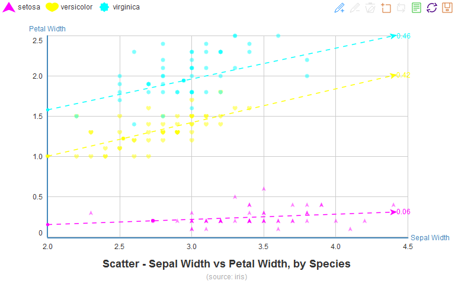

大规模散点图(2000个点以上)同样可以秒级出图(但html文件会变得很大)。


```r
x <- rnorm(2001)*2
e <- vector()
for (i in 1:2001)  e <- c(e,rnorm(1,0,x[i]+abs(min(x))))
df <- data.frame(x, sin=sin(x)+e/20, cos=cos(x)+e/20)
df <- melt(df,id="x")
echartR(df,x=~x,y=~value,series=~variable,type='scatter',
        palette='wsj_red_green',symbolList='circle', AxisAtZero=F,
        title='Scatter of 2,001 points', subtitle = 'Large-scale scatter')
```

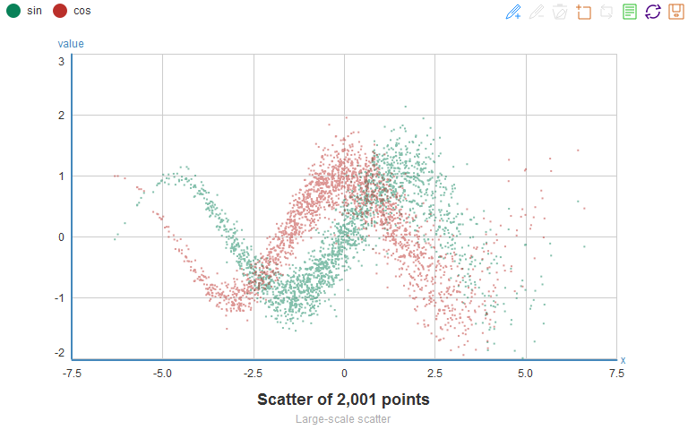

## Bubble 气泡图

气泡图同样来源于散点图。type改为`bubble`即可，如不指定`weight`变量，函数默认指定y为气泡权重。

### Mono-series Bubble 单系列气泡图


```r
echartR(data = iris, x = ~Sepal.Width, y = ~Petal.Width, weight = ~Petal.Length,
        type = 'bubble', palette='solarized_cyan',
        title = paste("Bubble - Sepal Width vs Petal Width,",
                      "weighed by Petal Length"),
        subtitle = '(source: iris)',
        xlab = 'Sepal Width', ylab = 'Petal Width')
```


### Multi-series Bubble 多系列气泡图

用`symbolList=c('circle','emptyCircle')`设置第1个数据系列为实心圆、剩下的数据系列以空心圆作为标志图形。palette设置为tableauGnOr(3)，只随机取该色板的3种颜色。

再做一个基于全集的线性回归(`lm()`)。由于无法显示在任何一个系列上，因此echartR生成了一个新的数据系列。前一节多系列散点图中，三个系列Sepal Width与Petal Width都正相关，而本例中，合并起来两者却呈负相关。这个例子形象地展示了分层分析的重要性。


```r
fit <- lm(Petal.Width~Sepal.Width,iris)
pred <- data.frame(Sepal.Width=c(min(iris$Sepal.Width),max(iris$Sepal.Width)))
yhat <- round(predict(fit,pred),2)
echartR(data = iris, x = ~Sepal.Width, y = ~Petal.Width, 
        weight = ~Petal.Length, series = ~Species, 
        symbolList=c('emptyCircle','circle'), 
        type = 'bubble', palette='tableaugnor(4)',
        title = paste('Bubble - Sepal Width vs Petal Width, by Species,',
                      'weighed by Petal Length'), 
        subtitle = '(source: iris)', xlab = 'Sepal Width', ylab = 'Petal Width',
        markLine=t(c('Reg Coef.','slope',round(fit$coefficients[[2]],2), 
                     pred[1,1],yhat[[1]],pred[2,1],yhat[[2]],F)))
```

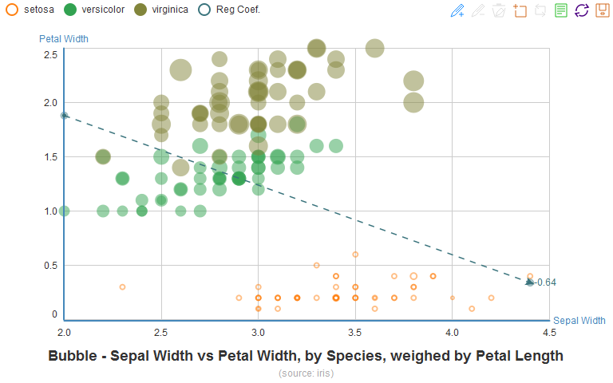

## Column 柱图

先生成一个汇总数据集`dtiris`。


```r
library(reshape2)
dfiris <- iris
dfiris$id <- row.names(iris)
dfiris <- melt(dfiris,id=c("Species","id"))
names(dfiris) <- c("Species","id","Param","Value")
dtiris <- dcast(dfiris[,c(1,3,4)],Species+Param~.,value.var="Value",mean)
names(dtiris) <- c("Species","Param","Mean")
knitr::kable(dcast(dtiris,Param~Species,sum,value.var="Mean"),
             format='html',caption="Table: Mean of parameters (iris)")
```

<table>
<caption>Table: Mean of parameters (iris)</caption>
 <thead>
  <tr>
   <th style="text-align:left;"> Param </th>
   <th style="text-align:right;"> setosa </th>
   <th style="text-align:right;"> versicolor </th>
   <th style="text-align:right;"> virginica </th>
  </tr>
 </thead>
<tbody>
  <tr>
   <td style="text-align:left;"> Sepal.Length </td>
   <td style="text-align:right;"> 5.006 </td>
   <td style="text-align:right;"> 5.936 </td>
   <td style="text-align:right;"> 6.588 </td>
  </tr>
  <tr>
   <td style="text-align:left;"> Sepal.Width </td>
   <td style="text-align:right;"> 3.428 </td>
   <td style="text-align:right;"> 2.770 </td>
   <td style="text-align:right;"> 2.974 </td>
  </tr>
  <tr>
   <td style="text-align:left;"> Petal.Length </td>
   <td style="text-align:right;"> 1.462 </td>
   <td style="text-align:right;"> 4.260 </td>
   <td style="text-align:right;"> 5.552 </td>
  </tr>
  <tr>
   <td style="text-align:left;"> Petal.Width </td>
   <td style="text-align:right;"> 0.246 </td>
   <td style="text-align:right;"> 1.326 </td>
   <td style="text-align:right;"> 2.026 </td>
  </tr>
</tbody>
</table>

### Tiled Column 平铺柱图


```r
echartR(data = dtiris, x = ~Param, y = ~Mean,  series = ~Species,
        type = 'bar', palette='fivethirtyeight',
        title = "Column - Parameter Mean by Species", 
        subtitle = '(source: iris)',legend_pos=3,
        xlab = 'Parameter', ylab = 'Mean')
```


### Stacked Column 堆积柱图


```r
echartR(data = dtiris, x = ~Param, y = ~Mean, 
        series = ~Species, stack=T,
        type = 'bar', palette='pander',
        title = "Column - Parameter Mean by Species",
        subtitle = '(source: iris)',
        xlab = 'Parameter', ylab = 'Mean', legend_pos=3)
```

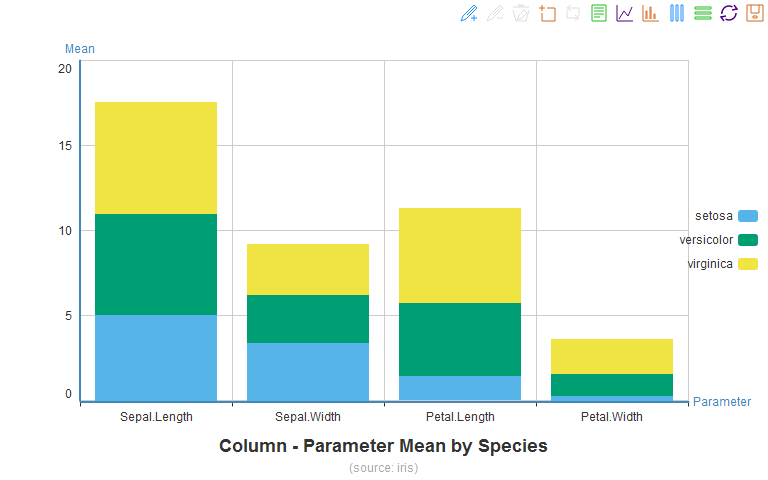

堆积与否，也可以简单地通过工具栏的`平铺`和`堆积`按钮切换。非常强大。

## Bar 条图

条图和柱图的区别只在于`xyflip`开关选项。

### Tiled Bar 平铺条图


```r
echartR(data = dtiris, x = ~Species, y = ~Mean, series = ~Param, 
        type = 'bar', palette='stata1', xyflip=T,
        title = 'Species-specific Mean by Parameters',
        subtitle = '(source: iris)', legend_pos=3,
        xlab = 'Species', ylab = 'Mean')
```

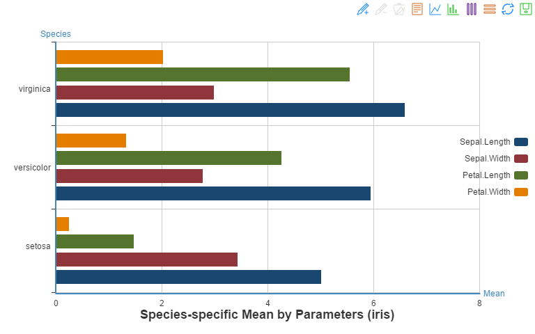

### Stacked Bar 堆积条图

palette设为calc的随机4种颜色。打开stack (`stack=TRUE`)。


```r
echartR(data = dtiris, x = ~Param, y = ~Mean, 
        series = ~Species, stack=T, xyflip=T,
        type = 'bar', palette='calc(5)',
        title = 'Parameter Mean by Species',
        subtitle = '(source: iris)',
        xlab = 'Parameter', ylab = 'Mean', legend_pos=3)
```

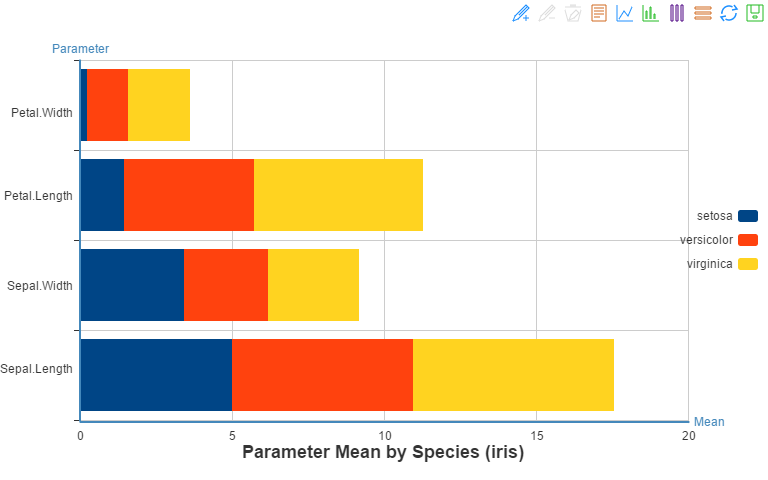

## Histogram 直方图

直方图是柱图的一种特例，只需要指定y变量。可通过`splitNumber`指定直方数(默认9)。`xyflip`设为TRUE则成为等价的横条图。

> Echarts规定柱/条图和散点图的自变量轴均为category类型，因此暂时无法简单地做出传统外观的直方图。


```r
echartR(airquality, y=~Temp, type='histogram', splitNumber=13,
        palette='pastel2', title='Histogram of temperature',
        subtitle = '(source: airquality)')
```


## Pie 饼图

用`mtcars`作为作图数据集。


```r
dtcars <- mtcars
dtcars$car <- row.names(dtcars)
dtcars$transmission <- as.factor(dtcars$am)
levels(dtcars$transmission) <- c("Automatic","Manual")
dtcars$cylinder <- as.factor(dtcars$cyl)
dtcars$carburetor <-as.factor(dtcars$carb)
```


```r
echartR(dtcars, x = ~transmission,  y = ~car, type='pie',
        palette='darkunica', 
        title='Number of cars by transmission',
        subtitle = '(source: mtcars)')
```

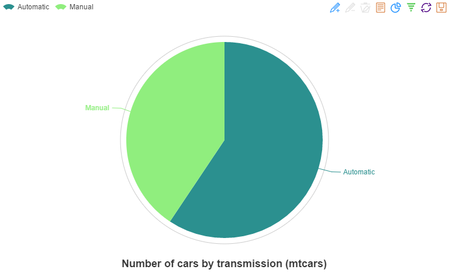

## Ring 环图

环形图是饼图的变形，只需将`type`改为'ring'。Echarts中只需要把饼图的半径参数扩展为包含内、外径的长度为2的向量即可。


```r
echartR(dtcars, x = ~cylinder,  y = ~car, type='ring',
        palette='hc', title='Number of Cylinders',
        subtitle = '(source: mtcars)')
```

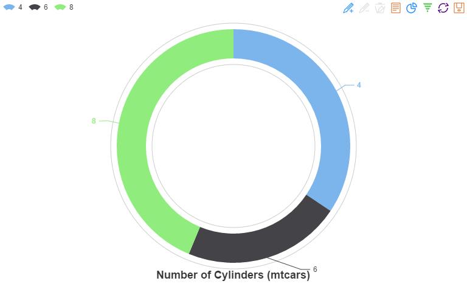

### Rose Nightingale玫瑰图


```r
echartR(dtcars, x = ~cylinder,  y = ~car, type='rose',
        palette='colorblind', title='Number of Cylinders',
        subtitle = '(source: mtcars)')
```

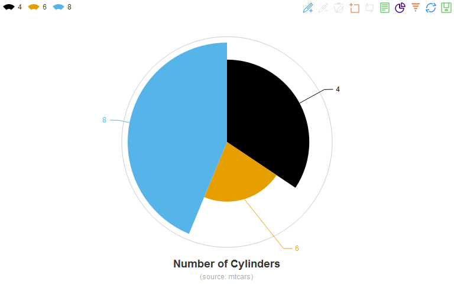

## Line 线图

### Unstacked Line 平铺线图

打开数据缩放，设置初始显示30-70%(`dataZoom=c(30,70)`)。


```r
airquality$Date <- strptime(paste(2015,airquality$Month,airquality$Day,sep="-"),
                            format="%F", tz="Asia/Taipei")
airquality$strDate <- with(airquality,paste(2015,Month,Day,sep="-"))
airquality$TempG <- cut(airquality$Temp,breaks=c(0,60,70,80,100))

echartR(airquality, x = ~Day, y= ~Wind, series=~Month, type='line', 
        dataZoom=c(30,70), symbolList='none', 
        palette='tableauBlRd', xlab = 'Days', ylab = 'Wind',
        title='Day-specific Wind by month (airquality)')
```

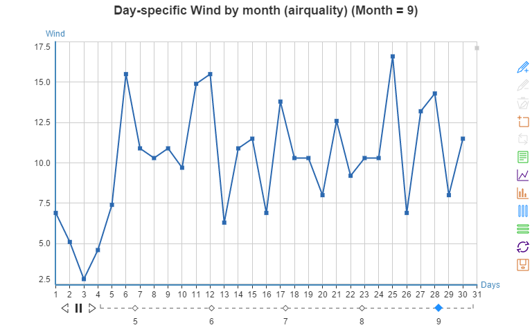

线段平滑(`type='linesmooth'`)，不显示标志图形(`symbolList='none'`)。Echarts对缺失值默认不填补，因此有很多断线。需要在数据前处理时自行作插值运算。


```r
airq <- melt(airquality[,c("Ozone","Solar.R","Wind","Temp","strDate")],
             id=c("strDate"))
airQ <- melt(airquality[,c("Wind","Temp","Date")],
             id=c("Date"))
echartR(airq, x = ~strDate, y= ~value, series= ~variable, type='linesmooth',
        symbolList='none', dataZoom=c(20,50),
        palette='tableauPrGy', xlab = 'Date', ylab = 'Measure',
        title='Climate measures by day', subtitle = '(source: airquality)')
```


### Stacked Line 堆积线图
设置xAxis和yAxis，关闭所有纵线(`color='none'`)，并显示横向间条(`banded=T`)。


```r
echartR(dfiris, x = ~id, y= ~Value, series= ~Param, type='line',stack=T,
        palette='tableauBlRd12', xlab = 'Sample ID', ylab = 'Measure',
        yAxis=list(color='none',banded=T),
        title='Parameter measures', subtitle = '(source: iris)')
```


线段平滑，不显示标志图形

```r
echartR(dfiris, x = ~id, y= ~Value, series= ~Param, type='linesmooth',stack=T,
        palette='tableauGnOr12', xlab = 'Sample ID', ylab = 'Measure',
        symbolList='none', yAxis=list(color='none'),
        title='Parameter measures', subtitle = '(source: iris)')
```


## Area 面积图
Echarts中，面积图本质上被定义为线图，只需通过`itemStyle`参数渲染颜色。

### Tiled Area 平铺面积图

```r
echartR(dfiris, x = ~id, y= ~Value, series= ~Param, type='area',
        palette='brbg', xlab = 'Sample ID', ylab = 'Measure',
        symbolList='emptyDiamond',title='Parameter measures',
        yAxis=list(color='none'), subtitle = '(source: iris)')
```


线段平滑`type='areasmooth'`，并打开数据缩放`dataZoom=TRUE`，初始显示40%-80%。

```r
echartR(dfiris, x = ~id, y= ~Value, series= ~Param, type='areasmooth',
        palette='PiYG', xlab = 'Sample ID', ylab = 'Measure', 
        symbolList='none', dataZoom=c(40,80),yAxis=list(color='none'),
        title='Parameter measures', subtitle = '(source: iris)')
```

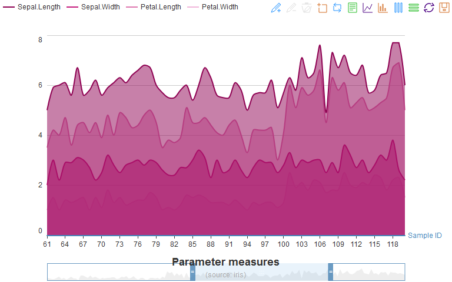

### Stacked Area 堆积面积图

```r
echartR(dfiris, x = ~id, y= ~Value, series= ~Param, type='area',stack=T,
        palette='PRGn', xlab = 'Sample ID', ylab = 'Measure',
        symbolList='emptyCircle',yAxis=list(color='none'),
        title='Parameter measures', subtitle = '(source: iris)')
```

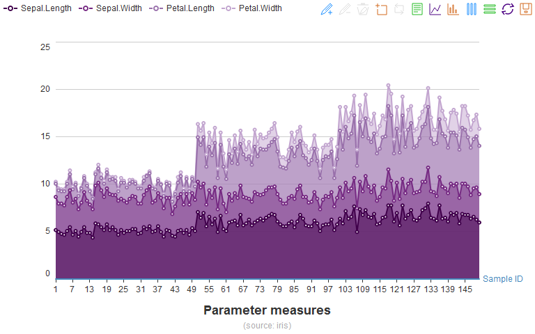

线段平滑(`type='areasmooth'`)。自定义色板向量。

```r
echartR(dfiris, x = ~id, y= ~Value, series= ~Param, type='areasmooth',stack=T,
        palette=c('red','yellow','limegreen','skyblue'), 
        xlab = 'Sample ID', ylab = 'Measure', 
        symbolList='none',yAxis=list(color='none'),
        title='Parameter measures', subtitle = '(source: iris)')
```


## Funnel 漏斗图

### Funnel 普通漏斗图


```r
echartR(dtcars, x = ~carburetor,  y = ~car, type='funnel',
        palette='RdBu', title='Number of carburetors of cars',
        subtitle = '(source: mtcars)',pos=list(legend=12))
```


### Pyramid 金字塔图
金字塔图即逆序漏斗图。

```r
echartR(dtcars, x = ~carburetor,  y = ~car, type='pyramid',
        palette='RdGy', title='Number of carburetors of cars',
        subtitle = '(source: mtcars)',pos=list(legend=12))
```

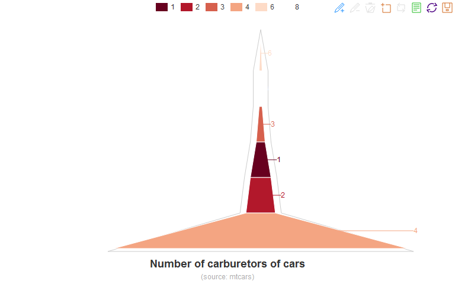

## Radar 雷达图

雷达图就是极坐标系下的线图/面积图，通过Echarts的`polar`参数模块控制。

### Hollow Radar 空心雷达


```r
browser <- as.data.frame(
    matrix(c(2001,390,208,15,9,0.5,2002,380,204,20,18,2,2003,370,200,25,27,4.5,
    2004,360,196,30,36,8,2005,350,192,35,45,12.5,2006,340,188,40,54,18,
    2007,330,184,45,63,24.5,2008,320,180,50,72,32,2009,310,176,55,81,40.5,
    2010,300,172,60,90,50,2011,290,168,65,99,60.5,2012,280,164,70,108,72,
    2013,270,160,75,117,84.5,2014,260,156,80,126,98,2015,250,152,85,135,112.5,
    2016,240,148,90,144,128,2017,230,144,95,153,144.5,2018,220,140,100,162,162,
    2019,210,136,105,171,180.5,2020,200,132,110,180,200,2021,190,128,115,189,220.5,
    2022,180,124,120,198,242,2023,170,120,125,207,264.5,2024,160,116,130,216,288,
    2025,150,112,135,225,312.5,2026,140,108,140,234,338,2027,130,104,145,243,364.5,
    2028,120,100,150,252,392),byrow=T,ncol=6)
    )
names(browser) <- c("Year","IE8-","IE9+","Safari","Firefox","Chrome")
browser <- melt(browser,id="Year")
echartR(browser, x= ~variable, y= ~value, series= ~Year, type='radar',
        palette=paste0('heat(',nlevels(as.factor(browser$Year)),")"),
        pos=list(legend=9), symbolList='none',
        title='Browser Mkt Occup Ratio', subtitle= 'Totally virtual data')
```

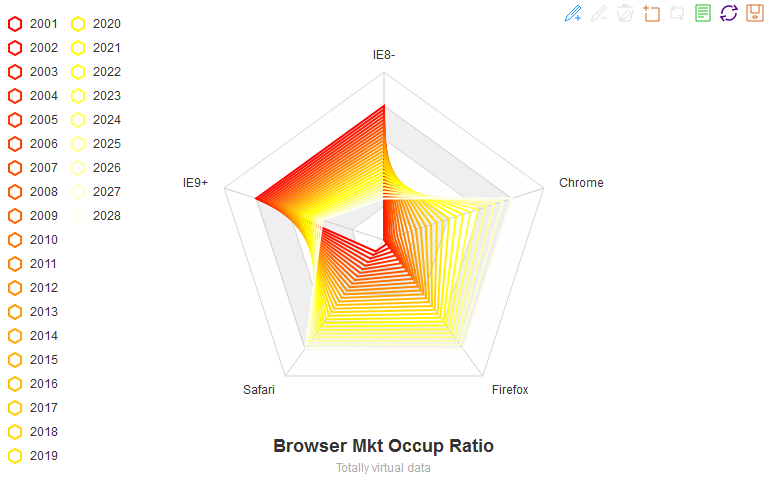

### Solid Radar 实心雷达


```r
player <- data.frame(name=c(rep("Philipp Lahm",8),rep("Dani Alves",8)),
                     para=rep(c("Passing%","Key passing","Comp crosses",
                                "Crossing%","Successful dribbles",
                                "Dispossessed","Dribbled past","Fouls"),2),
                     value=c(89.67, 1.51, 0.97, 24.32, 0.83, 0.86, 1.15, 0.47,
                            86.62, 2.11, 0.99, 20.78, 1.58, 1.64, 0.9, 1.71))
echartR(player, x= ~para, y= ~value, series= ~name, type='radarfill',
        symbolList='none', palette=c('firebrick1','dodgerblue'),
        title='Lahm vs Alves', subtitle= '(by @mixedknuts)')
```

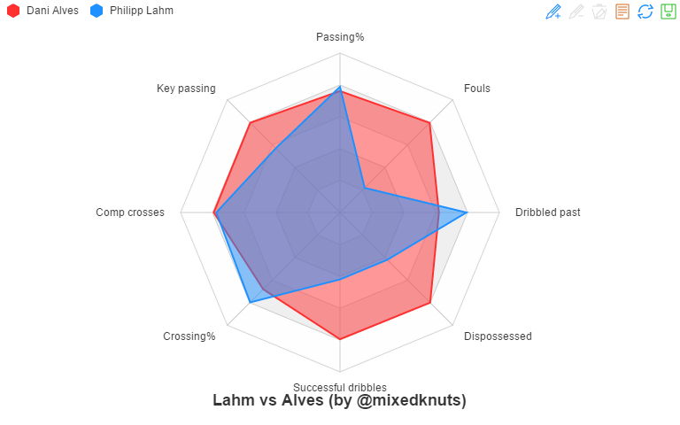

## Map 地图

R和Rstudio的中文转码在Windows里一直是老大难。在本文档，Rstudio的默认编码采用CP936编码，文档用UTF-8。如直接在程序内读数据集，用iconv转码后，落单的汉字仍然会显示为乱码。可先下载[ChinaGDP.txt](https://raw.githubusercontent.com/madlogos/Shared_Doc/master/Shared_Documents/ChinaGDP.txt)到本地，`readLines`读入。

最令人orz的地方是Chrome不能正确显示地图，变成了一堆锯齿。


```r
#gdp <- readLines("https://raw.githubusercontent.com/madlogos/Shared_Doc/master/Shared_Documents/ChinaGDP.txt")
gdp <- readLines("ChinaGDP.txt")
dtgdp <- unlist(strsplit(gdp,split=","))
dtgdp <- as.data.frame(t(matrix(dtgdp,nrow=3)),stringsAsFactors=F)
names(dtgdp) <- c('Year','Prov',"GDP")
dtgdp$GDP <- as.numeric(dtgdp$GDP) 
knitr::kable(dcast(dtgdp,Prov~Year,sum,value.var="GDP"), format='html',
         caption="Table: 2012-2014 GDP of Provinces in China (Million USD)")
```

<table>
<caption>Table: 2012-2014 GDP of Provinces in China (Million USD)</caption>
 <thead>
  <tr>
   <th style="text-align:left;"> Prov </th>
   <th style="text-align:right;"> 2012 </th>
   <th style="text-align:right;"> 2013 </th>
   <th style="text-align:right;"> 2014 </th>
  </tr>
 </thead>
<tbody>
  <tr>
   <td style="text-align:left;"> 安徽 </td>
   <td style="text-align:right;"> 272666 </td>
   <td style="text-align:right;"> 307416 </td>
   <td style="text-align:right;"> 339401 </td>
  </tr>
  <tr>
   <td style="text-align:left;"> 北京 </td>
   <td style="text-align:right;"> 283238 </td>
   <td style="text-align:right;"> 314871 </td>
   <td style="text-align:right;"> 347249 </td>
  </tr>
  <tr>
   <td style="text-align:left;"> 福建 </td>
   <td style="text-align:right;"> 312107 </td>
   <td style="text-align:right;"> 351347 </td>
   <td style="text-align:right;"> 391609 </td>
  </tr>
  <tr>
   <td style="text-align:left;"> 甘肃 </td>
   <td style="text-align:right;"> 89508 </td>
   <td style="text-align:right;"> 101208 </td>
   <td style="text-align:right;"> 111273 </td>
  </tr>
  <tr>
   <td style="text-align:left;"> 广东 </td>
   <td style="text-align:right;"> 904046 </td>
   <td style="text-align:right;"> 1003746 </td>
   <td style="text-align:right;"> 1103605 </td>
  </tr>
  <tr>
   <td style="text-align:left;"> 广西 </td>
   <td style="text-align:right;"> 206497 </td>
   <td style="text-align:right;"> 232158 </td>
   <td style="text-align:right;"> 255144 </td>
  </tr>
  <tr>
   <td style="text-align:left;"> 贵州 </td>
   <td style="text-align:right;"> 108550 </td>
   <td style="text-align:right;"> 129284 </td>
   <td style="text-align:right;"> 150599 </td>
  </tr>
  <tr>
   <td style="text-align:left;"> 海南 </td>
   <td style="text-align:right;"> 45236 </td>
   <td style="text-align:right;"> 50805 </td>
   <td style="text-align:right;"> 56989 </td>
  </tr>
  <tr>
   <td style="text-align:left;"> 河北 </td>
   <td style="text-align:right;"> 420990 </td>
   <td style="text-align:right;"> 456976 </td>
   <td style="text-align:right;"> 478953 </td>
  </tr>
  <tr>
   <td style="text-align:left;"> 河南 </td>
   <td style="text-align:right;"> 468900 </td>
   <td style="text-align:right;"> 519212 </td>
   <td style="text-align:right;"> 568786 </td>
  </tr>
  <tr>
   <td style="text-align:left;"> 黑龙江 </td>
   <td style="text-align:right;"> 216896 </td>
   <td style="text-align:right;"> 232237 </td>
   <td style="text-align:right;"> 244829 </td>
  </tr>
  <tr>
   <td style="text-align:left;"> 湖北 </td>
   <td style="text-align:right;"> 352482 </td>
   <td style="text-align:right;"> 398316 </td>
   <td style="text-align:right;"> 445514 </td>
  </tr>
  <tr>
   <td style="text-align:left;"> 湖南 </td>
   <td style="text-align:right;"> 350958 </td>
   <td style="text-align:right;"> 395622 </td>
   <td style="text-align:right;"> 440328 </td>
  </tr>
  <tr>
   <td style="text-align:left;"> 吉林 </td>
   <td style="text-align:right;"> 189136 </td>
   <td style="text-align:right;"> 209608 </td>
   <td style="text-align:right;"> 224715 </td>
  </tr>
  <tr>
   <td style="text-align:left;"> 江苏 </td>
   <td style="text-align:right;"> 856368 </td>
   <td style="text-align:right;"> 955269 </td>
   <td style="text-align:right;"> 1059587 </td>
  </tr>
  <tr>
   <td style="text-align:left;"> 江西 </td>
   <td style="text-align:right;"> 205131 </td>
   <td style="text-align:right;"> 231520 </td>
   <td style="text-align:right;"> 255724 </td>
  </tr>
  <tr>
   <td style="text-align:left;"> 辽宁 </td>
   <td style="text-align:right;"> 393607 </td>
   <td style="text-align:right;"> 437216 </td>
   <td style="text-align:right;"> 466018 </td>
  </tr>
  <tr>
   <td style="text-align:left;"> 内蒙古 </td>
   <td style="text-align:right;"> 251574 </td>
   <td style="text-align:right;"> 271788 </td>
   <td style="text-align:right;"> 289274 </td>
  </tr>
  <tr>
   <td style="text-align:left;"> 宁夏 </td>
   <td style="text-align:right;"> 37090 </td>
   <td style="text-align:right;"> 41417 </td>
   <td style="text-align:right;"> 44802 </td>
  </tr>
  <tr>
   <td style="text-align:left;"> 青海 </td>
   <td style="text-align:right;"> 29997 </td>
   <td style="text-align:right;"> 33925 </td>
   <td style="text-align:right;"> 37460 </td>
  </tr>
  <tr>
   <td style="text-align:left;"> 山东 </td>
   <td style="text-align:right;"> 792289 </td>
   <td style="text-align:right;"> 882974 </td>
   <td style="text-align:right;"> 967419 </td>
  </tr>
  <tr>
   <td style="text-align:left;"> 山西 </td>
   <td style="text-align:right;"> 191886 </td>
   <td style="text-align:right;"> 203485 </td>
   <td style="text-align:right;"> 207714 </td>
  </tr>
  <tr>
   <td style="text-align:left;"> 陕西 </td>
   <td style="text-align:right;"> 228969 </td>
   <td style="text-align:right;"> 259078 </td>
   <td style="text-align:right;"> 287978 </td>
  </tr>
  <tr>
   <td style="text-align:left;"> 上海 </td>
   <td style="text-align:right;"> 319710 </td>
   <td style="text-align:right;"> 348804 </td>
   <td style="text-align:right;"> 383554 </td>
  </tr>
  <tr>
   <td style="text-align:left;"> 四川 </td>
   <td style="text-align:right;"> 378183 </td>
   <td style="text-align:right;"> 424026 </td>
   <td style="text-align:right;"> 464555 </td>
  </tr>
  <tr>
   <td style="text-align:left;"> 天津 </td>
   <td style="text-align:right;"> 204259 </td>
   <td style="text-align:right;"> 232031 </td>
   <td style="text-align:right;"> 255950 </td>
  </tr>
  <tr>
   <td style="text-align:left;"> 西藏 </td>
   <td style="text-align:right;"> 11105 </td>
   <td style="text-align:right;"> 13041 </td>
   <td style="text-align:right;"> 14990 </td>
  </tr>
  <tr>
   <td style="text-align:left;"> 新疆 </td>
   <td style="text-align:right;"> 118896 </td>
   <td style="text-align:right;"> 134991 </td>
   <td style="text-align:right;"> 150812 </td>
  </tr>
  <tr>
   <td style="text-align:left;"> 云南 </td>
   <td style="text-align:right;"> 163318 </td>
   <td style="text-align:right;"> 189255 </td>
   <td style="text-align:right;"> 208612 </td>
  </tr>
  <tr>
   <td style="text-align:left;"> 浙江 </td>
   <td style="text-align:right;"> 549154 </td>
   <td style="text-align:right;"> 606609 </td>
   <td style="text-align:right;"> 653668 </td>
  </tr>
  <tr>
   <td style="text-align:left;"> 重庆 </td>
   <td style="text-align:right;"> 180746 </td>
   <td style="text-align:right;"> 204364 </td>
   <td style="text-align:right;"> 232230 </td>
  </tr>
</tbody>
</table>

```r
dtgdp$Prov <- as.factor(enc2native(dtgdp$Prov))
dtgdp$Year<- as.factor(dtgdp$Year)
```

### Area 区块标注

开启数据漫游，并定义色板。`subtitle_url`链接为本例数据源。通过`markPoint`参数也可以在区块标注地图中标注某些点，但效果并不是很好。


```r
top3 <- dcast(dtgdp[dtgdp$Prov %in% c("广东","江苏","山东"),c("Prov","GDP")],
              Prov~., sum)
top3 <- cbind(top3,rep("Top3",3),c(32.04,23.16,36.65),c(118.78,113.23,117.00),
              rep(T,3))
top3 <- top3[,c(3,1,2,4:6)]
names(top3) <- c("Series","Prov","GDP","Xcoord","Ycoord","Effect")
for (i in 1:2) top3[,i]<-as.character(top3[,i])

echartR(dtgdp, x = ~Prov, y = ~GDP, series= ~Year, 
        type=c('map','china','area'), palette='gdocs',
        title="GDPs of China Provinces, 2012-2014 (Million USD)",
        subtitle='(source: Wikipedia)',
        subtitle_url="https://raw.githubusercontent.com/madlogos/Shared_Doc/master/Shared_Documents/ChinaGDP.txt",
        dataRangePalette=c('red','orange','yellow','green','limegreen'),
        dataRange=c('High',"Low"),pos=list(toolbox=3),markPoint=top3)
```

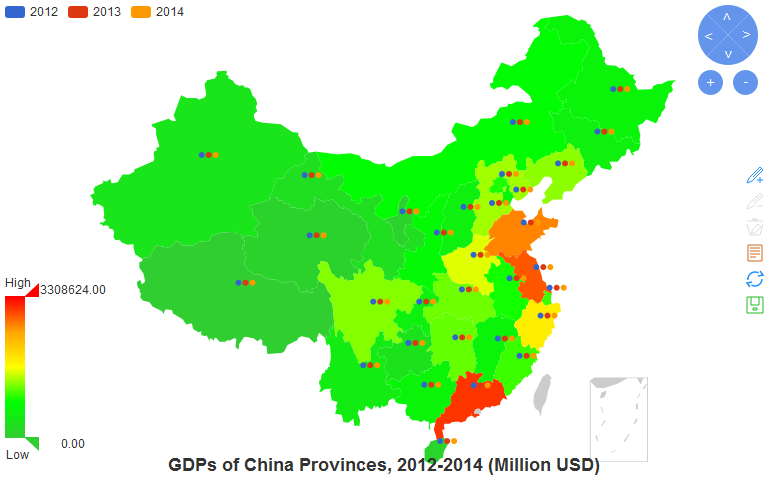

用世界GDP前20粗糙演示世界地图。漫游轴切分为10档(`splitNumber=10`)。


```r
worldgdp <- data.frame(
    country=c('United States of America','China','Japan','Germany',
              'United Kingdom','France','Brazil', 'Italy','India','Russia',
              'Canada','Australia','South Korea','Spain','Mexico','Indonesia',
              'Netherlands','Turkey','Saudi Arabia','Switzerland'),
    GDP=c(17418925,10380380,4616335,3859547,2945146,2846889,2353025,2147952,
          2049501,1857461,1788717,1444189,1416949,1406855,1282725,888648,866354,
          806108,752459,712050))
echartR(worldgdp, x = ~country, y = ~GDP, type=c('map','world','area'),
        title="Nations with top 20 GDPs, 2014 (Million USD)",
        subtitle = '(source: Wikipedia)', 
        subtitle_url="https://en.wikipedia.org/wiki/List_of_countries_by_GDP_(nominal)",
        dataRangePalette='rainbow(5)', dataRange=c("High","Low"), 
        splitNumber=10, pos=list(toolbox=3))
```

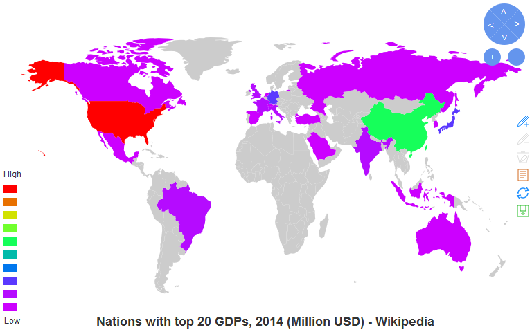

### Point 点标注
将[China PM2.5数据集](https://raw.githubusercontent.com/madlogos/Shared_Doc/master/Shared_Documents/China%20PM2.5.txt)下载到本地，`readLines`读入。


```r
#chinapm2 <- readLines('https://raw.githubusercontent.com/madlogos/Shared_Doc/master/Shared_Documents/China%20PM2.5.txt')
chinapm25 <- enc2native(unlist(strsplit(paste0(readLines("China PM2.5.txt"), collapse=","),",")))
chinapm25 <- as.data.frame(matrix(chinapm25,byrow=T,ncol=4),stringsAsFactors=F)
names(chinapm25) <- c("City","PM25","ycoord","xcoord")
for (i in 2:4) chinapm25[,i] <- as.numeric(chinapm25[,i])
top5 <- head(chinapm25[order(chinapm25$PM25,decreasing=T),],5)
top5$Name <- "Top 5"
top5$effect <- T
top5 <- top5[,c(5,1,2,4,3,6)]

echartR(chinapm25, x=~City, y=~PM25, xcoord=~xcoord, ycoord=~ycoord,
        type=c('map','china','point'),title='PM2.5 in Chinese cities',
        subtitle="(source: PM25.in)",subtitle_url="http://pm25.in/",
        dataRange=c("High","Low"), pos=list(toolbox=3), 
        dataRangePalette=c('maroon','red','orange','yellow','lightgreen','green'),
        markPoint=top5)
```

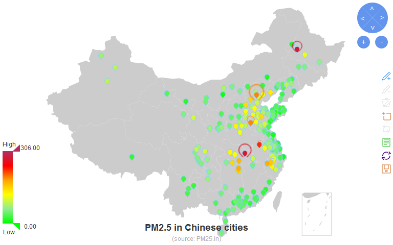


### Line 线标注
线标注地图比较特殊，数据集要包括y（数量）、x（起点地名）、x1（终点地名）、series（数据系列）、xcoord（起点纬度）、ycoord（起点经度）、xcoord1（终点纬度）、ycoord1（终点经度）。额外标注的话，`markLine`数据集格式变为下表（第2列格式为'起点'/'终点'）：

series name/index * | Path | Value | P0 x | P0 y | P1 x| P1 y | Light effect
------------------|-----------|-------|-------|------|-----|------|-----------
String or number  | From/To | num | x val | y val | x val| y val | TRUE / FALSE

下载[南航航班.txt](https://raw.githubusercontent.com/madlogos/Shared_Doc/master/Shared_Documents/CZflight.txt)到本地。`readLines`读入1-2行。
作点标注的时候，按`markPoint`语法将数据集处理成6列：series, name, value, xcoord, ycoord, effect。


```r
flight <- readLines("CZflight.txt")[1]
flight <- as.data.frame(matrix(unlist(strsplit(flight,",")),byrow=T,ncol=2),
                        stringsAsFactors=F)
names(flight) <- c("From","To")
flightCoord <- readLines("CZflight.txt")[2]
flightCoord <- as.data.frame(matrix(unlist(strsplit(flightCoord,",")),byrow=T,ncol=3),
                             stringsAsFactors=F)
for (i in 2:3) flightCoord[,i] <- as.numeric(flightCoord[,i])
names(flightCoord) <- c("City","Ycoord","Xcoord")
flight <- merge(flight,flightCoord,by.x="From",by.y="City",all.x=T)
flight <- merge(flight,flightCoord,by.x="To",by.y="City",all.x=T)
Tier1 <- dcast(flight,From~.,length)
Tier1 <- merge(Tier1,unique(flight[,c("From","Xcoord.x","Ycoord.x")]),by="From",all.x=T)
Tier1$effect <- T
Tier1 <- Tier1[,c(1,1:5)]

flight$y <- NA
echartR(flight, x=~From, x1=~To, y=~y, series=~From, xcoord=~Xcoord.x, ycoord=~Ycoord.x,
        xcoord1=~Xcoord.y, ycoord1=~Ycoord.y, type=c('map','china','line'),
        pos=list(toolbox=3), title="南方航空公司主要航班线路",markPoint=Tier1)
```

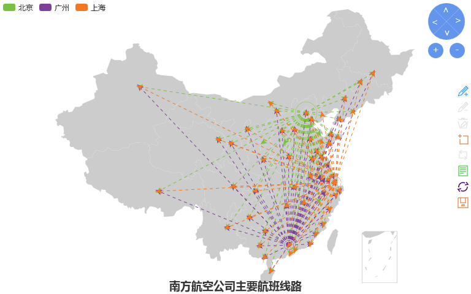

上个例子只作标线而未注数量。也可以对这些标线的数值进行渲染。仍以CZflight.txt为例，读取3-5行（我偷懒了，存在同一个文件里）。本例通过`theme`设置背景为灰黑色(#1b1b1b)，边界线为暗蓝色royalblue4。legend中设置单选模式，初始选中数据系列'北京'。数据集处理的具体策略是x - ycoord1变量放背景数据集，包含所有迁徙关系；markLine放三个突出系列的数量，markPoint则放终点的数据。最后的效果同时包括了背景标线、突出标线和点标。全部打开炫光特效。

```r
migrate <- as.data.frame(matrix(unlist(strsplit(readLines("CZflight.txt")[3],",")),
                                byrow=T,ncol=2),stringsAsFactors=F)
names(migrate) <- c("From","To")
migrateCoord <- as.data.frame(matrix(unlist(strsplit(readLines("CZflight.txt")[4],",")),
                                byrow=T,ncol=3),stringsAsFactors=F)
for (i in 2:3) migrateCoord[,i] <- as.numeric(migrateCoord[,i])
names(migrateCoord) <- c("City","Ycoord","Xcoord")
migrate <- merge(migrate,migrateCoord,by.x="From",by.y="City",all.x=T)
migrate <- merge(migrate,migrateCoord,by.x="To",by.y="City",all.x=T)
migrate$series <- "全国"
# markLine source data
migrateEm <- as.data.frame(matrix(unlist(strsplit(readLines("CZflight.txt")[5],",")),
                                byrow=T,ncol=3),stringsAsFactors=F)
migrateEm[,3] <- as.numeric(migrateEm[,3])
names(migrateEm) <- c("From","To","Val")
#migrate <- merge(migrate,migrateEm,by=c("From","To"),all.x=T)
#migrate$Val[is.na(migrate$Val)] <- "-"
migrate$Val <- NA
migrateEm <- merge(migrateEm, migrateCoord, by.x="From",by.y="City",all.x=T)
migrateEm <- merge(migrateEm, migrateCoord, by.x="To",by.y="City",all.x=T)
# markLine dataset (8 col)
markline <- migrateEm[,c(2,1,3,5,4,7,6)]
markline$To <- paste(markline$From,markline$To,sep="/")
markline$effect <- F
# markPoint dataset (6 col)
markpoint <- migrateEm[,c(2,1,3,7,6)]
markpoint$effect <- T
# plot
echartR(migrate, x=~From, x1=~To, y=~Val, series=~series, xcoord=~Xcoord.x,
          ycoord=~Ycoord.x, xcoord1=~Xcoord.y, ycoord1=~Ycoord.y,
        type=c('map','china','line'), palette=c("Gray","Orange","Green","Purple"),
        pos=list(toolbox=3), title="百度迁徙（模拟数据）", dataRange=c("High","Low"),
        dataRangePalette=c("red","orange",'gold','green1','aquamarine2','royalblue4'),
        legend=list(mode='single',select=c('北京')), 
        markLinesmooth=markline, markPoint=markpoint, 
        theme=list(backgroundColor="#1b1b1b", borderColor="royalblue4"))
```


## Wordcloud 词云
直接knitr时readLines读取网页会报错，此例将网页 'http://top.baidu.com/buzz?b=1' 的源代码保存为本地txt后再读取。


```r
#baiduhot <- paste0(readLines("http://top.baidu.com/buzz?b=1"),collapse="")
baiduhot <- paste0(readLines("Baidu Hot Words.txt"),collapse="")
hotword <- gsub(".+?<a class=\"list-title\"[^>]+?>([^<>]+?)</a>.+?<span class=\"icon-(rise|fair|fall)\">(\\d+?)</span>.+?","\\1\t\\3\t",baiduhot)
hotword <- enc2native(gsub("^(.+?)\t{4,}.+$","\\1",hotword))
hotword <- t(matrix(unlist(strsplit(hotword,"\t")),nrow=2))
hotword <- as.data.frame(hotword,stringsAsFactors=F)
names(hotword) <- c("Keyword","Freq")
hotword$Freq <- as.numeric(hotword$Freq)
hotword <- hotword[order(hotword$Freq,decreasing=T),]
knitr::kable(hotword, format='html', row.names=F,
             caption="Table: Baidu hot words Aug 18 (descending order by Freq)")
```

<table>
<caption>Table: Baidu hot words Aug 18 (descending order by Freq)</caption>
 <thead>
  <tr>
   <th style="text-align:left;"> Keyword </th>
   <th style="text-align:right;"> Freq </th>
  </tr>
 </thead>
<tbody>
  <tr>
   <td style="text-align:left;"> 霆锋让杨幂骑脖子 </td>
   <td style="text-align:right;"> 545761 </td>
  </tr>
  <tr>
   <td style="text-align:left;"> 文章澄清牵手门 </td>
   <td style="text-align:right;"> 329896 </td>
  </tr>
  <tr>
   <td style="text-align:left;"> 幼童在车里热死 </td>
   <td style="text-align:right;"> 194836 </td>
  </tr>
  <tr>
   <td style="text-align:left;"> 葛天反击刘翔粉丝 </td>
   <td style="text-align:right;"> 187192 </td>
  </tr>
  <tr>
   <td style="text-align:left;"> 老汉被指强奸入狱 </td>
   <td style="text-align:right;"> 185177 </td>
  </tr>
  <tr>
   <td style="text-align:left;"> 男子惨遭挤压身亡 </td>
   <td style="text-align:right;"> 178935 </td>
  </tr>
  <tr>
   <td style="text-align:left;"> 孕妇离奇死亡 </td>
   <td style="text-align:right;"> 106216 </td>
  </tr>
  <tr>
   <td style="text-align:left;"> 海参阅兵照爆红 </td>
   <td style="text-align:right;"> 103025 </td>
  </tr>
  <tr>
   <td style="text-align:left;"> 大妈为狗刷卡占座 </td>
   <td style="text-align:right;"> 96443 </td>
  </tr>
  <tr>
   <td style="text-align:left;"> 女子家门口被性侵 </td>
   <td style="text-align:right;"> 85931 </td>
  </tr>
  <tr>
   <td style="text-align:left;"> 拒加领导微信被炒 </td>
   <td style="text-align:right;"> 83213 </td>
  </tr>
  <tr>
   <td style="text-align:left;"> 曝王思聪进娱乐圈 </td>
   <td style="text-align:right;"> 76823 </td>
  </tr>
  <tr>
   <td style="text-align:left;"> 女客梦中惊醒 </td>
   <td style="text-align:right;"> 54671 </td>
  </tr>
  <tr>
   <td style="text-align:left;"> 男子大脑消失过半 </td>
   <td style="text-align:right;"> 43599 </td>
  </tr>
  <tr>
   <td style="text-align:left;"> 中国国际小姐大赛 </td>
   <td style="text-align:right;"> 39775 </td>
  </tr>
  <tr>
   <td style="text-align:left;"> 全国宜居城市排行 </td>
   <td style="text-align:right;"> 33747 </td>
  </tr>
  <tr>
   <td style="text-align:left;"> 抗战纪念币发行 </td>
   <td style="text-align:right;"> 33563 </td>
  </tr>
  <tr>
   <td style="text-align:left;"> 天津爆炸头七 </td>
   <td style="text-align:right;"> 28963 </td>
  </tr>
  <tr>
   <td style="text-align:left;"> 9月3日双倍工资 </td>
   <td style="text-align:right;"> 27298 </td>
  </tr>
  <tr>
   <td style="text-align:left;"> 奔驰女拒交停车费 </td>
   <td style="text-align:right;"> 22560 </td>
  </tr>
  <tr>
   <td style="text-align:left;"> 65岁女子产4胞胎 </td>
   <td style="text-align:right;"> 21674 </td>
  </tr>
  <tr>
   <td style="text-align:left;"> 英国疯抢状元笔记 </td>
   <td style="text-align:right;"> 17742 </td>
  </tr>
  <tr>
   <td style="text-align:left;"> 王思聪恋情坐实 </td>
   <td style="text-align:right;"> 16641 </td>
  </tr>
  <tr>
   <td style="text-align:left;"> 杨栋梁被查 </td>
   <td style="text-align:right;"> 16311 </td>
  </tr>
  <tr>
   <td style="text-align:left;"> 扎破手指险送命 </td>
   <td style="text-align:right;"> 15738 </td>
  </tr>
  <tr>
   <td style="text-align:left;"> 曼谷市中心爆炸 </td>
   <td style="text-align:right;"> 15444 </td>
  </tr>
  <tr>
   <td style="text-align:left;"> 男童跌入开水盆 </td>
   <td style="text-align:right;"> 14827 </td>
  </tr>
  <tr>
   <td style="text-align:left;"> 城管碰瓷执法 </td>
   <td style="text-align:right;"> 13619 </td>
  </tr>
  <tr>
   <td style="text-align:left;"> 明星真人秀片酬 </td>
   <td style="text-align:right;"> 12979 </td>
  </tr>
  <tr>
   <td style="text-align:left;"> 2万卖初夜反遭抢 </td>
   <td style="text-align:right;"> 12249 </td>
  </tr>
  <tr>
   <td style="text-align:left;"> 扮蝙蝠侠行善身亡 </td>
   <td style="text-align:right;"> 11928 </td>
  </tr>
  <tr>
   <td style="text-align:left;"> 天津回应毒气传闻 </td>
   <td style="text-align:right;"> 11305 </td>
  </tr>
  <tr>
   <td style="text-align:left;"> 金星喷范冰冰粉丝 </td>
   <td style="text-align:right;"> 9470 </td>
  </tr>
  <tr>
   <td style="text-align:left;"> 网曝何猷君将大婚 </td>
   <td style="text-align:right;"> 9115 </td>
  </tr>
  <tr>
   <td style="text-align:left;"> 袁咏仪儿子上学 </td>
   <td style="text-align:right;"> 7282 </td>
  </tr>
  <tr>
   <td style="text-align:left;"> 男子当街注射毒品 </td>
   <td style="text-align:right;"> 6530 </td>
  </tr>
  <tr>
   <td style="text-align:left;"> 世界大学学术排名 </td>
   <td style="text-align:right;"> 6488 </td>
  </tr>
  <tr>
   <td style="text-align:left;"> 郑州小伙出租云朵 </td>
   <td style="text-align:right;"> 6454 </td>
  </tr>
  <tr>
   <td style="text-align:left;"> 熊跃辉被调查 </td>
   <td style="text-align:right;"> 6232 </td>
  </tr>
  <tr>
   <td style="text-align:left;"> 安倍或访华 </td>
   <td style="text-align:right;"> 6123 </td>
  </tr>
  <tr>
   <td style="text-align:left;"> 天津下雨出现泡沫 </td>
   <td style="text-align:right;"> 5884 </td>
  </tr>
  <tr>
   <td style="text-align:left;"> 三星上海发布会 </td>
   <td style="text-align:right;"> 5137 </td>
  </tr>
  <tr>
   <td style="text-align:left;"> 张艺兴已被涂黑 </td>
   <td style="text-align:right;"> 4990 </td>
  </tr>
  <tr>
   <td style="text-align:left;"> 谎称自杀被救索赔 </td>
   <td style="text-align:right;"> 4301 </td>
  </tr>
  <tr>
   <td style="text-align:left;"> 唐嫣被指炒作恋情 </td>
   <td style="text-align:right;"> 3722 </td>
  </tr>
  <tr>
   <td style="text-align:left;"> 幼师用脚猛夹男童 </td>
   <td style="text-align:right;"> 3683 </td>
  </tr>
  <tr>
   <td style="text-align:left;"> 网曝柏青孙子失联 </td>
   <td style="text-align:right;"> 3538 </td>
  </tr>
  <tr>
   <td style="text-align:left;"> 女子逼小学生让座 </td>
   <td style="text-align:right;"> 3245 </td>
  </tr>
  <tr>
   <td style="text-align:left;"> 全球华人富豪榜 </td>
   <td style="text-align:right;"> 3010 </td>
  </tr>
  <tr>
   <td style="text-align:left;"> 惠若琪错过世界杯 </td>
   <td style="text-align:right;"> 2981 </td>
  </tr>
</tbody>
</table>


```r
echartR(hotword[1:30,], x=~Keyword, y=~Freq, type="wordcloud", 
        title="Baidu Word Search Top 30", palette=NULL,
        title_url="http://top.baidu.com/buzz?b=1", 
        subtitle="Tuesday, Auguest 18, 2015")
```


## Chord 和弦图
### Simple chord 简单和弦图
和弦图需要用到x,x1和y变量。其中x和x1是连接关系，y为权重。


```r
deutsch <- data.frame(player=c('Kruse','Kramer','Neuer','Boateng','Lahm','Kroos',
                               'Muller','Gotze','Badstuber','Hummels','Weidenfeller',
                               'Reus','Gundogan'),
                      club=c(rep('Monchengladbach',2),rep('Bayern',7),
                             rep('Dortmund',4)),
                      weight=rep(1,13), stringsAsFactors=F)
echartR(deutsch,x=~player, y=~weight, x1=~club, type='chord', 
          title='Deutsch Soccer Team - Clubs',pos=list(legend=10))
```

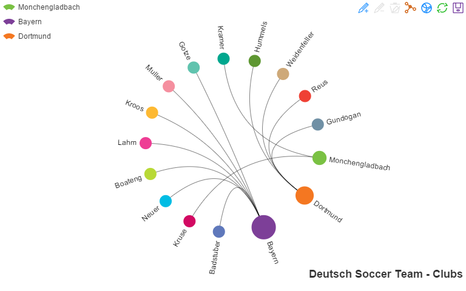


也可以对矩阵作图。

```r
grpmtx <- matrix(c(11975, 5871, 8916, 2868, 1951, 10048, 2060, 6171, 8010, 16145,
                   8090, 8045, 1013, 990, 940, 6907),byrow=T,nrow=4)
dimnames(grpmtx) <- list(LETTERS[1:4],LETTERS[1:4])
knitr::kable(as.data.frame(grpmtx),format='html',
             caption="Table: Group A-D Mutual Transition")
```

<table>
<caption>Table: Group A-D Mutual Transition</caption>
 <thead>
  <tr>
   <th style="text-align:left;">   </th>
   <th style="text-align:right;"> A </th>
   <th style="text-align:right;"> B </th>
   <th style="text-align:right;"> C </th>
   <th style="text-align:right;"> D </th>
  </tr>
 </thead>
<tbody>
  <tr>
   <td style="text-align:left;"> A </td>
   <td style="text-align:right;"> 11975 </td>
   <td style="text-align:right;"> 5871 </td>
   <td style="text-align:right;"> 8916 </td>
   <td style="text-align:right;"> 2868 </td>
  </tr>
  <tr>
   <td style="text-align:left;"> B </td>
   <td style="text-align:right;"> 1951 </td>
   <td style="text-align:right;"> 10048 </td>
   <td style="text-align:right;"> 2060 </td>
   <td style="text-align:right;"> 6171 </td>
  </tr>
  <tr>
   <td style="text-align:left;"> C </td>
   <td style="text-align:right;"> 8010 </td>
   <td style="text-align:right;"> 16145 </td>
   <td style="text-align:right;"> 8090 </td>
   <td style="text-align:right;"> 8045 </td>
  </tr>
  <tr>
   <td style="text-align:left;"> D </td>
   <td style="text-align:right;"> 1013 </td>
   <td style="text-align:right;"> 990 </td>
   <td style="text-align:right;"> 940 </td>
   <td style="text-align:right;"> 6907 </td>
  </tr>
</tbody>
</table>

```r
grpmtx <- melt(grpmtx)
echartR(grpmtx,x=~Var1, y=~value, x1=~Var2, type='chord', 
          title='Group A-D mutual transition',pos=list(legend=10))
```

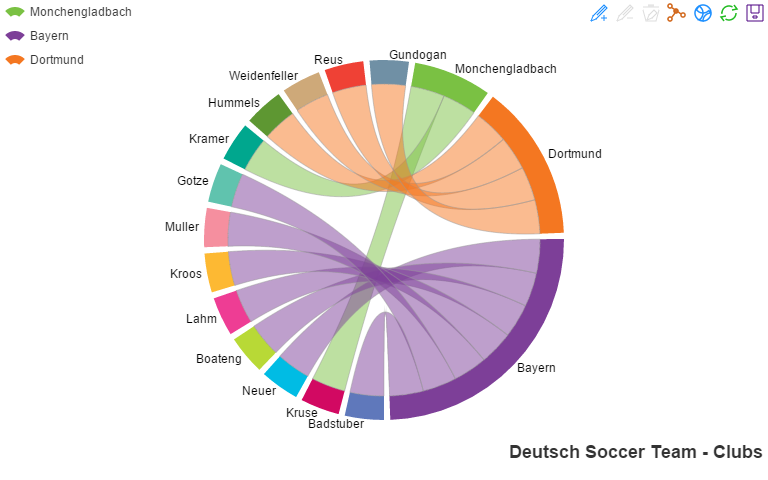


## Force 力导向布局图


## Candlestick K线图


## Tree 树状图


## Heatmap 热力图


## Gauge 仪表盘


# Recognized Issues 已知的问题

1. `echartR`比较接近于`lattice`，而不是`ggplot2`图层叠加的思路。每次使用都要一次性编辑所有需要的参数；
1. 函数本身写得比较笨重，技术还不行；
1. 当没有数据系列的时候，如显示图例，会被拆成一串单字节字符；
1. 未实现的功能：
    1. Force，candlestick(k)还没有开发；
    1. 仍然不支持时间格式的坐标轴（series中数据结构有问题）；
    1. 仍然不支持动态时间轴；
    1. tooltip不够智能；
    1. 进阶功能（包括多图联动、双坐标轴等）仍未开发；
1. **注意**：如要改进，千万不要在函数代码中`set.seed()`，这会全局锁定种子数，导致knitr时每做一图都按该种子随机化`htmlwidget id`。最终的文档中，某些图可能会无法按指定代码出图，而是重复其他的图（串id）。

